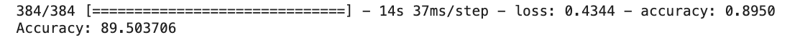

# NLP Project (Behold) - Team Orange

## **Business Problem:** 
A common problem for Behold is the extremely manual classification of new products into their specific brands. Behold has supplier relationships from many global clothing vendors and marketplaces, but has found that the bottleneck for scaling out the number of products they can sell is identifying the brands associated with each new product.

## **Project Goal:**
1. Build an NLP classification model to predict which brand a new product should be assigned.
2. Create a brand recommender algorithm that would recommend an outfit given a customer’s search query.

## **Part 1 - Classification**
### Model Overview:  
- We used Neural Network LSTM to build an classification algorithm which classifies 31 different brands with **89.5%** testing.accuracy. (testing data contains 20% of entire dataset)   
  

### Data Pre-Processing
- **Feature Engineer**
    - We created 5 features, and they are `location`, `color`,`material`,`category`,`random_description`
    - `location`: where did this product make.
    - `color`: color of this product.
    - `material`: what did this problem made of.
    - `category`: which category does this product belong. (top, bottom.etc)
    - `random_description`: details or description of this product. 
    - After creating features, we concatenated those 5 features into one column, separated by a blank space between each feature. `concat_features`.

- **Word Embedding**
    - We used word embedding technique to vectorize `concat_features` column. 
    - We used `GloVe Vectors` which was pre-trained by google. 
    - We only looked at top 200 words with the most frequency, meaning, ignoring words which show less frequently to aviod overfitting, and we also defined our max sentence length as 128. 

### Fit LSTM Model
- We had 61355 rows X 128 columns word vector ready for modeling, and we had 31 categories for y labels.
- Then, we separated training (80%) and testing (20%) dataset.
- We used LSTM model with two Dense layers, 10 epochs, 0.02 learning rate.
- Finally, we achieved **89.5%** accuracy on testing dataset.

## **Part 2 - Recommender Algorithm**

### Overview
After trying to assign categories by ourselves and using those in our search query, we realized that our algorithm performance is not as good as expected. Thus, we decided to focus on the data with category labels, which are the data in the outfit_combination dataset.

### Data Pre-processing 
- We merged the outfit_combination dataset with the product dataset using left join. 
- We combined the features 'product_full_name', 'details', and 'description' together as our new text feature. 
- We used regex to remove punctuations on the combined feature and used the nltk package to remove stopwords. 
- We performed lemmatization on the combined text feature.

### Clean the input query:
- We used regex to remove punctuation and digits in the input query
- We then applied domain knowledge to determine the product category that the user is trying to search. Then our algorithm will return the most similarity product in that category. 

### Recommendation function:
- We used TF-IDF to vectorize the product table. Max_feature is set to 1000 to reduce complexity
- We then summed the TF-IDF scores for each document
- We tokenized each product and calculated the uning total embedding for each token
- We then divided the running total by the sum of TF-IDF score for the document to generate the weighted TF-IDF embedding for each sentence. 
- We calculated cosine similarity between the query and each product
- As mention in the last section, we determined the product category of the search query beforehand. Our algorithm will return the most similar product in the category of interest.
- We extracted the outfit ID of the most similar product and found all the products share the same outfit ID. We returned all the products in that outfit set.  
 
 
 
### What we tried but not used:
1.	We first tried to use spaCy's internal similarity function to calculate the similarity between the user query and each of our new text feature which is the combination of 'product_full_name', 'details', and 'description'. Then, we find the product with the largest similarity, if the product already has an expert-defined outfit, then the function will return the whole outfit, otherwise, it will return the single product with the highest similarity. We chose not to use this function because that spaCy has a computationally expensive algorithm to find the similarity, so that each query may take up to 20 minutes to finish the execution. So, we decide to try more efficient algorithm.

2.	We also tried to label the category for each item based on given text features such as product name and description instead of using the ‘product_category’ column in the original dataset. There are four reasons why we chose to use word frequency and regex matching instead of building a classification model when making labeling the category:
- The ‘product_category’ column which contains the given information of each product’s category while most rows containing the value ‘unknown’.  
- For the products with known category, there are only about 800 unique products which is too small a part compared to the whole dataset. 
- Among these products with category labels, we found some cases that the product name and the category are obviously contradict with each other.  
- There are only 5 product categories in the given labels while we thought there are many products which do not belong to any of these categories.

However, when we tried to label the product without category based on word frequency, it turned out that the match results did not have a satisfying accuracy which may further affect the selected product by the search function. We believed that an accurate result is more important for our function, so that we decide to use only the products with product categories and products with outfit_id in the outfit dataset to match the query. Although less data entries are used, we are able to obtain a more accurate result.

